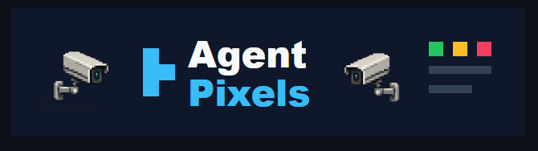
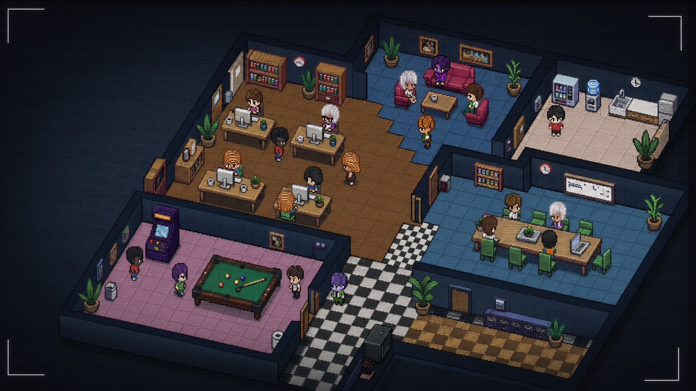
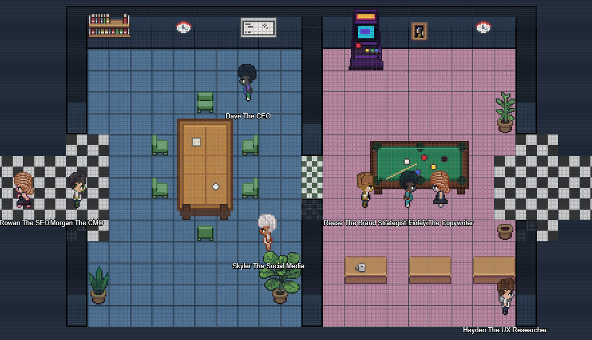
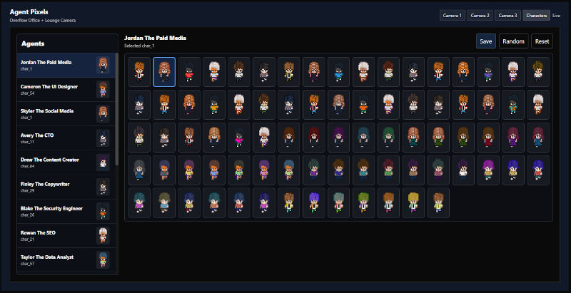

# Agent Pixels (Paperclip plugin)



Agent Pixels turns a Paperclip company of AI agents into a live pixel-art office
camera. Working agents walk to their desks, idle agents drift toward the lounge,
kitchen, boardroom, and games areas, and you can watch it all from three camera
angles.

Learn more at [agent-pixels.com](https://agent-pixels.com).

> **Licensing status — read this before redistributing.**
>
> This vendored copy carries **no license from its own author**. The upstream
> repository [`gcampton/Agent-Pixels`](https://github.com/gcampton/Agent-Pixels)
> declares no `LICENSE` file and GitHub reports `license: null` for it. Its
> package.json therefore deliberately has **no `license` field**, and this
> package does not invent one.
>
> The upstream project is itself a port/derivative of
> [**Pixel-Agents**](https://github.com/pixel-agents-hq/pixel-agents) by
> **Pablo De Lucca**, which *is* MIT licensed
> (`Copyright (c) 2026 Pablo De Lucca`). The sprite art and the office layout
> in `public/assets/` derive from that project, so the MIT notice is preserved
> verbatim in [NOTICE.md](./NOTICE.md).
>
> Because the intermediate Paperclip port never declared terms, redistribution
> of this directory rests on the upstream MIT grant plus the author's implied
> permission. That ambiguity is unresolved, not cleared. Get an explicit license
> from gcampton before publishing this plugin or shipping it in a release.

## Attribution

| Role | Who | Where |
| --- | --- | --- |
| Paperclip plugin author | [gcampton](https://github.com/gcampton) (Garratt Campton) | <https://github.com/gcampton/Agent-Pixels> |
| Original work — "Pixel-Agents" VSCode extension | Pablo De Lucca | <https://github.com/pixel-agents-hq/pixel-agents> |

Both attributions are load-bearing. Please keep them when forking.



## What it does

- Shows Paperclip agents walking around a multi-room pixel office.
- Moves working agents toward desks and idle agents toward lounge, kitchen,
  boardroom, and games areas.
- Supports three camera views across a combined office layout
  (Office + Lounge, Boardroom + Staff Kitchen, Overflow Office + Lounge).
- Includes assignable character sprites so each agent can have a consistent
  look.
- Expands the original pixel-agent style into a denser company view for larger
  Paperclip teams.

## Screenshots





## Manifest surface

Declared in [`src/manifest.ts`](./src/manifest.ts):

| Field | Value |
| --- | --- |
| `id` | `agent-pixels.camera` |
| `categories` | `["ui"]` |
| `capabilities` | `companies.read`, `agents.read`, `instance.settings.register`, `ui.sidebar.register`, `ui.page.register` |
| `ui.slots` | `sidebar`, `page` (route `agent-pixels`), `settingsPage` |

The worker ([`src/worker.ts`](./src/worker.ts)) exposes two `getData` handlers
and nothing else:

- `camera-room` — lists the company's agents and infers a pixel activity kind
  (`coding` / `research` / `writing` / `meeting` / `idle`) from each agent's
  status, name, title, and role.
- `character-settings` — lists the company's agents for the character picker.

## Build

Inside the Paperclip monorepo:

```bash
pnpm install
pnpm --filter @agent-pixels/paperclip-plugin build
```

The build runs in two stages:

1. `tsc` typechecks and emits the module graph into `dist/` (this also produces
   `dist/manifest.js` and `dist/worker.js`).
2. `node ./esbuild.config.mjs` bundles the worker, manifest, and UI with the
   host contract defaults from `createPluginBundlerPresets`, then
   `scripts/write-ui-assets.mjs` copies `public/assets/` into `dist/ui/assets/`
   and generates `agent-pixels-assets.json`.

To typecheck only:

```bash
pnpm --filter @agent-pixels/paperclip-plugin typecheck
```

Upstream's `scripts/package-release.mjs` (which produced a standalone release
zip) is not vendored: this monorepo ships plugins through its own release
packaging, and that script also required a system `zip` binary.

## Assets

Character sprites live in `public/assets/characters/`.

Add new sprites as `char_81.png`, `char_82.png`, etc. The build script
auto-detects `char_*.png` files and adds them to the plugin asset index.

### Asset dimensions

Agent Pixels uses a 16px tile grid.

| Asset type | Location | Size |
| --- | --- | --- |
| Character sprite sheet | `public/assets/characters/char_*.png` | `112x96` PNG |
| Character frame | inside each character sheet | `16x32` |
| Character sheet layout | inside each character sheet | `7` columns x `3` rows |
| Floor tile | `public/assets/floors/floor_*.png` | `16x16` |
| Wall tile sheet | `public/assets/walls/wall_0.png` | `64x128` |
| Furniture sprites | `public/assets/furniture/**` | Multiples of `16px` |
| Office layout | `public/assets/default-layout-1.json` | `21x22` tiles (`336x352px`) |
| Boardroom/kitchen layout | `public/assets/agent-pixels-layout-boardroom-kitchen.json` | `22x15` tiles (`352x240px`) |
| Combined camera map | generated in the UI | `68x22` tiles (`1088x352px`) |

Character sheets use three direction rows: front, back, and side. The opposite
side direction is mirrored by the renderer.

Common furniture sizes currently in use:

| Asset | Size |
| --- | --- |
| Desk front | `48x32` |
| Desk side | `16x64` |
| PC sprites | `16x32` |
| Wooden/cushioned chairs | `16x32` or `16x16` |
| Sofa front/back | `32x16` |
| Sofa side | `16x32` |
| Boardroom table | `48x80` |
| Pool table | `80x48` |
| Arcade machine | `32x48` |
| Paintings/whiteboard | `16x32` or `32x32` |
| Plants | `16x32` or `32x48` |

`scripts/generate-character-variants.py` is the upstream helper that produced
the character sheets. It is vendored unchanged for asset-pipeline fidelity.

## Differences from upstream

Beyond the build and packaging rework described above:

- `package.json` declares `@paperclipai/plugin-sdk` as `workspace:*` so the SDK
  resolves inside this monorepo. Upstream instead pointed its `tsconfig.json`
  `paths` at an absolute path on the author's machine
  (`/home/garratt/dev/4_repos/paperclip/...`) and bundled the SDK through an
  esbuild alias.
- The upstream `tsconfig.json` hardcoded `noEmit: true` and those absolute
  `paths`; both are removed.
- `src/manifest.ts` sets `author` to the `gcampton` GitHub handle. Upstream used
  the full name `Garratt Campton`; Pablo De Lucca is credited in the manifest
  description and in this README rather than in the author field.
- `pnpm-lock.yaml`, `build.mjs`, and `scripts/package-release.mjs` from the
  standalone upstream checkout are not vendored.
- Upstream's own `.gitignore` ignored `/docs` and `AGENTS.md`; neither file
  exists in this checkout, and this repository's root `.gitignore` applies.

## Support

For feature requests, bugs, or help using Agent Pixels, see
[agent-pixels.com/support](https://www.agent-pixels.com/support).

## Contributing

Upstream pull requests are welcome for bug fixes, plugin improvements, new room
assets, furniture, and character sprites.